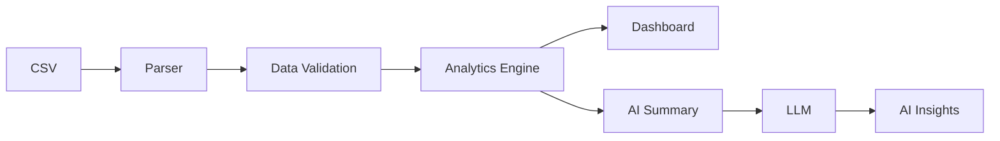

# InsightPilot

An AI analytics copilot that lets users upload CSV business data, explore metrics and charts, and ask natural-language questions about the dataset.

This project demonstrates data processing, AI-assisted analytics, dashboards, CSV parsing, visualization, Next.js, TypeScript, and business intelligence patterns.

## Overview

InsightPilot turns a CSV into an interactive analytics workspace:

1. Upload (or load demo) sales-style CSV data
2. Validate file type, size, columns, and malformed rows
3. Auto-detect dates, numbers, categories, and missing values
4. Compute KPIs and filterable charts
5. Ask **InsightPilot** questions grounded in a compact dataset summary (not the raw CSV)

## Features

- **CSV upload** with type/size validation, preview, and issue reporting
- **Automatic column profiling** (date / number / category / string / boolean)
- **KPI cards**: Revenue, Orders, Customers, Average Order Value, Conversion Rate
- **Charts**: revenue over time, revenue by category, revenue by region, orders over time
- **Filters**: date range, category, region (charts and KPIs update together)
- **Ask InsightPilot** panel with example prompts
- **Load Demo Dataset** from `public/demo/sales.csv`
- **Responsive** dashboard with sidebar, dataset selector, table, and AI panel

## Architecture



### High-level flow

| Layer | Responsibility |
| --- | --- |
| Client UI | Upload/demo load, filters, KPI/charts/table, chat UX |
| CSV pipeline | PapaParse → validation → type detection → coercion |
| Analytics engine | Filter rows, compute KPIs and chart aggregates |
| AI API (`/api/ask`) | Build compact summary → OpenAI (or local fallback) |

## Data Processing

1. **Validate** `.csv` extension/MIME and max size (5 MB)
2. **Parse** with PapaParse (header row required)
3. **Detect** column types from value samples; track missing rates
4. **Coerce** numbers/dates/booleans for analytics
5. **Surface** malformed/mostly-empty row warnings in the preview

Sales-oriented columns (`revenue`, `date`, `category`, `region`, `customer_id`, `status`, …) are resolved heuristically so the demo KPIs work out of the box, while remaining flexible for similar CSVs.

## AI Architecture

InsightPilot **never** sends the full CSV text as the model prompt.

1. The client posts the parsed dataset + question to `/api/ask`
2. The server builds a **compact summary** via `buildDatasetSummary()`:
   - column profiles
   - KPIs
   - capped time-series and category/region rollups
   - active filters and notes
3. Only that summary (plus the question) is sent to the LLM
4. System instructions require answering **only** from present metrics and **never inventing numbers**
5. If `OPENAI_API_KEY` is unset, a deterministic **local fallback** answers from the same summary

## Tech Stack

- **Next.js** (App Router) + **TypeScript**
- **Tailwind CSS** + shadcn-style UI primitives
- **Recharts** for visualization
- **PapaParse** for CSV parsing
- **Zod** for request validation
- **OpenAI API** for LLM insights
- **Vitest** for unit tests

PostgreSQL is optional for a future persistence layer (saved datasets / chat history) and is not required to run the demo.

## Setup

```bash
npm install
cp .env.example .env.local
# Optional: set OPENAI_API_KEY and OPENAI_MODEL in .env.local
npm run dev
```

Open [http://localhost:3000](http://localhost:3000).

### Scripts

| Command | Description |
| --- | --- |
| `npm run dev` | Start development server |
| `npm run lint` | ESLint |
| `npm run typecheck` | TypeScript (`tsc --noEmit`) |
| `npm test` | Vitest suite |
| `npm run build` | Production build |

## Demo Dataset

`public/demo/sales.csv` is a realistic multi-month sales extract (~469 orders) with:

- `order_id`, `date`, `customer_id`, `category`, `region`, `product`
- `quantity`, `unit_price`, `revenue`, `status`

March 2025 is intentionally softer (especially Electronics / Europe) so prompts like “Why did revenue decline in March?” have a clear signal in the summary.

Use **Load Demo Dataset** in the UI, or call `GET /api/demo`.

## Security

- API keys stay server-side (`OPENAI_API_KEY` in env, never exposed to the client)
- Upload size is capped; only CSV files are accepted
- LLM prompts are built from aggregates, reducing accidental PII row dumps
- Still treat uploaded business data as sensitive: do not commit real customer CSVs
- Zod validates `/api/ask` payloads

## Future Improvements

- Persist datasets and chat history in PostgreSQL
- Server-side upload storage + signed URLs
- Streaming AI responses
- More chart types and cohort / retention analytics
- Role-based access and multi-tenant workspaces
- Client-side summary-only ask payloads for very large files
- Export dashboards to PDF/CSV

## License

MIT
